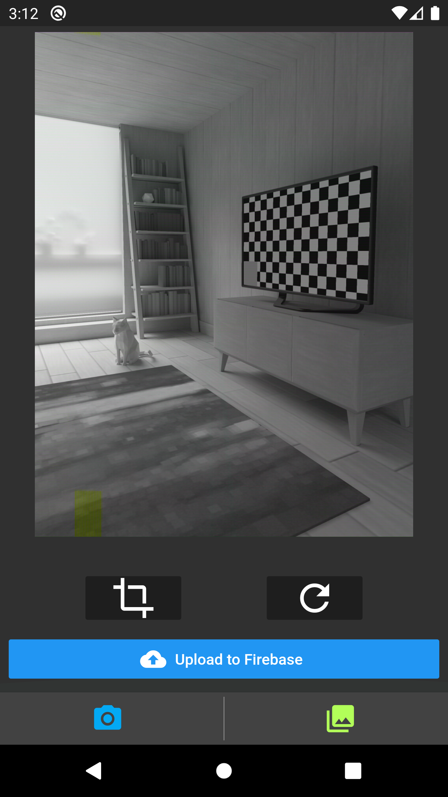
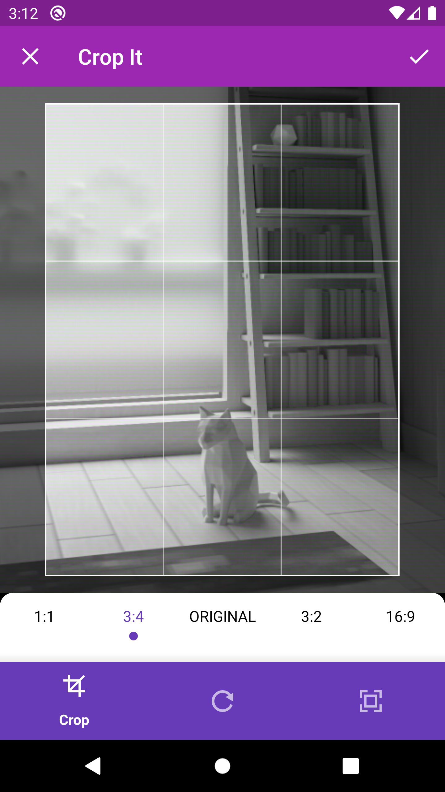
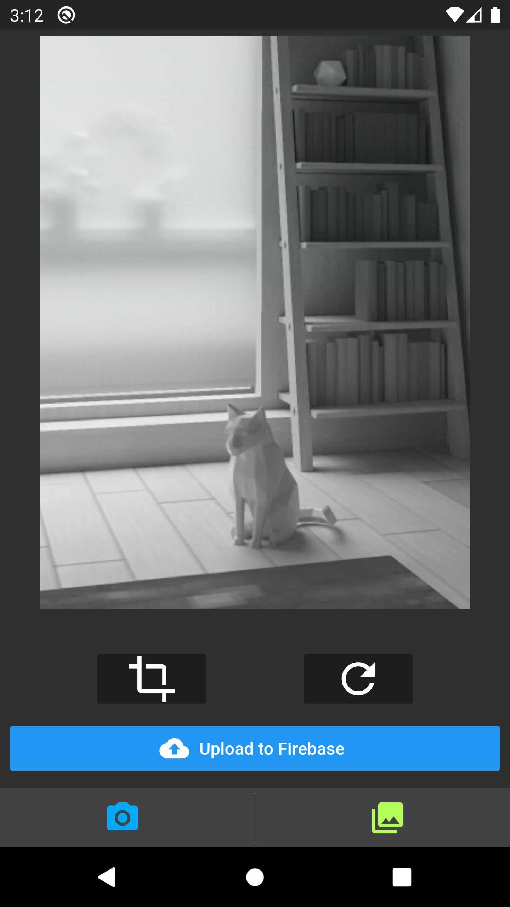

# firebasestorageuploads

A new Flutter application.

## Getting Started

This project is a starting point for a Flutter application witch save images in Firebase Storage.

A few resources to get you started if this is your first Flutter project:

## Getting Started

* Capture images from the device camera or image gallery.

* Import Dependencies.

* Crop, rotate, and resize an image file.

* Upload files to a Cloud Storage bucket and show a visual progress indicator.

* Disable security rules on your Firebase Storage

 rules_version = '2';
 service firebase.storage {
   match /b/{bucket}/o {
     match /{allPaths=**} {
       allow read, write: if true;
     }
   }
 }

## Screen

<table>
    <tr>
        <td style="padding:5px">
            
        </td>
        <td style="padding:5px">
            
        </td>
    </tr>
</table>

<table>
    <tr>
        <td style="padding:5px">
            
        </td>
        <td style="padding:5px">
            
        </td>
    </tr>
</table>

<table>
    <tr>
        <td style="padding:5px">
            
        </td>
        <td style="padding:5px">
            
        </td>
    </tr>
</table>

<table>
    <tr>
        <td style="padding:5px">
            
        </td>
        <td style="padding:5px">
            
        </td>
    </tr>
</table>

## A few resources to get you started if this is your first Flutter project:

- Flutter File Uploads

    https://fireship.io/lessons/flutter-file-uploads-cloud-storage/

- image_cropper

    https://pub.dev/packages/image_cropper

- image_picker

    https://pub.dev/packages/image_picker

- Cloud Storage

    https://firebase.google.com/docs/storage

- firebase_storage

    https://pub.dev/packages/firebase_storage

- firebase_core

    https://pub.dev/packages/firebase_core

